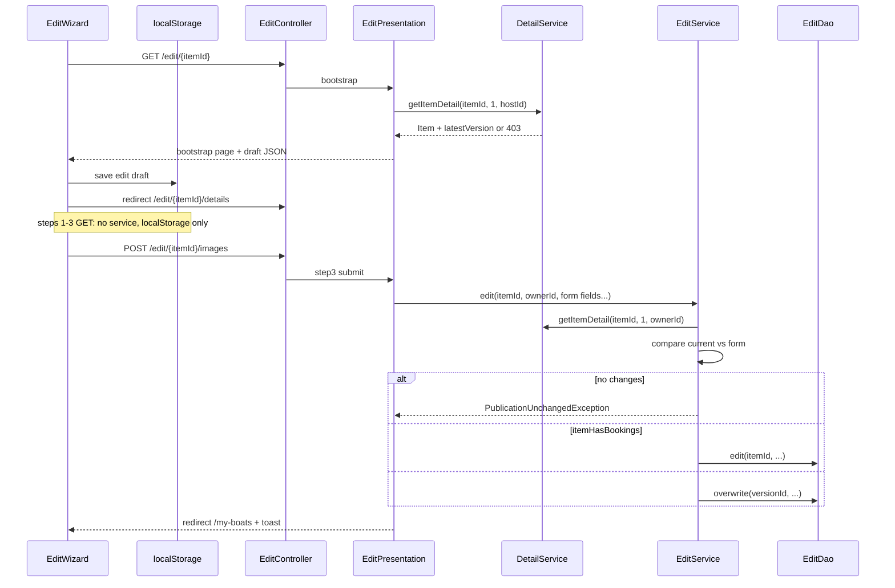

# Edit publication wizard redo

## Current state

- **Publish flow**: [`PublishController`](webapp/src/main/java/ar/edu/itba/paw/webapp/controller/PublishController.java) + [`PublishPresentation`](webapp/src/main/java/ar/edu/itba/paw/webapp/presentation/PublishPresentation.java) + [`publish-wizard.js`](webapp/src/main/webapp/js/publish-wizard.js).
- **Old edit flow** (to remove): `/my-boats/{id}/edit` → [`PublishActionPresentation`](webapp/src/main/java/ar/edu/itba/paw/webapp/presentation/PublishActionPresentation.java) + [`edit-publication.jsp`](webapp/src/main/webapp/WEB-INF/views/edit-publication.jsp).
- **Detail stack**: [`DetailService.getItemDetail`](service-contracts/src/main/java/ar/edu/itba/paw/services/DetailService.java) loads latest version (availabilities + media) with no ownership check today.
- **Legacy item stack** (`ItemService` / `ItemDao`): not used by the new edit flow.

## Separate edit stack (new)

Edit gets its own vertical slice, parallel to publish. **Do not modify** `PublishService` / `PublishDao`. **Do not use** `ItemService` / `ItemDao`.

| Layer            | New file           | Module                  |
| ---------------- | ------------------ | ----------------------- |
| Controller       | `EditController`   | `webapp`                |
| Presentation     | `EditPresentation` | `webapp`                |
| Service contract | `EditService`      | `service-contracts`     |
| Service impl     | `EditServiceImpl`  | `services`              |
| DAO contract     | `EditDao`          | `persistence-contracts` |
| DAO impl         | `EditJpaDao`       | `persistence`           |

Ownership and loading current version data for bootstrap + change detection go through **overloaded `DetailService`**, not `EditDao`.

## Data flow (localStorage wizard — same model as publish)

**Only one GET hits the service for form data:**

| Request                           | Service call?                                              | Data source                                                                               |
| --------------------------------- | ---------------------------------------------------------- | ----------------------------------------------------------------------------------------- |
| `GET /edit/{itemId}`              | **Yes** — `DetailService.getItemDetail(itemId, 1, hostId)` | Server builds draft JSON → JS writes **localStorage** → redirect                          |
| `GET /edit/{itemId}/details`      | **No**                                                     | `edit-wizard.js` reads **localStorage**, prefills step 1                                  |
| `GET /edit/{itemId}/availability` | **No**                                                     | **localStorage** (+ hidden fields from draft on POST)                                     |
| `GET /edit/{itemId}/images`       | **No**                                                     | **localStorage** (+ gallery state in draft/JS)                                            |
| `POST` steps 1–2                  | **No** (validate + redirect only)                          | Form + **localStorage** updated by JS on submit                                           |
| `POST` step 3                     | **Yes** — `EditService.edit(...)`                          | Form multipart POST; service reloads current item via DetailService for compare + persist |

Steps 1–3 GET handlers render the same empty shells as publish; **`edit-wizard.js`** owns draft read/write. If localStorage has no draft (or wrong `itemId`), redirect back to `GET /edit/{itemId}` to re-bootstrap.

## Target architecture



## URL map (confirmed)

| Step      | GET                           | POST success redirect           |
| --------- | ----------------------------- | ------------------------------- |
| Bootstrap | `/edit/{itemId}`              | → `/edit/{itemId}/details`      |
| Step 1    | `/edit/{itemId}/details`      | → `/edit/{itemId}/availability` |
| Step 2    | `/edit/{itemId}/availability` | → `/edit/{itemId}/images`       |
| Step 3    | `/edit/{itemId}/images`       | → `/my-boats#my-publications`   |

Update [`my-boats.jsp`](webapp/src/main/webapp/WEB-INF/views/my-boats.jsp) edit link to `/edit/${item.id}`.

---

## Backend

### 1. Detail ownership overload

Extend [`DetailDao`](persistence-contracts/src/main/java/ar/edu/itba/paw/persistence/DetailDao.java) and [`DetailService`](service-contracts/src/main/java/ar/edu/itba/paw/services/DetailService.java):

```java
// existing — unchanged behaviour
Item getItemDetail(int itemId, int reviewPage);

// new overload — when hostId is provided, enforce ownership
Item getItemDetail(int itemId, int reviewPage, int hostId);
```

**[`DetailImpl`](services/src/main/java/ar/edu/itba/paw/services/DetailImpl.java)**:

- Delegate load to existing DAO query.
- After load, if `item.getHost().getId() != hostId` → throw [`ForbiddenOperationException`](models/src/main/java/ar/edu/itba/paw/models/exceptions/ForbiddenOperationException.java) (handled by [`GlobalExceptionHandler`](webapp/src/main/java/ar/edu/itba/paw/webapp/controller/GlobalExceptionHandler.java) → 403).
- Existing public detail page keeps calling the 2-arg method (no ownership gate).

Optionally optimize the 3-arg path in [`DetailJpaDao`](persistence/src/main/java/ar/edu/itba/paw/persistence/DetailJpaDao.java) with `AND i.host_id = :hostId` in the version fetch so non-owners get `ItemNotFoundException` mapped to 403 in the service — either approach is fine as long as non-owners never see item data.

### 2. Service contract — `EditService` (`service-contracts`)

Single method — same business fields as `PublishService.create`, plus `itemId`:

```java
void edit(
    int itemId,
    int ownerId,
    int typeId,
    String title,
    String description,
    int pricePerHour,
    int capacityPeople,
    int weight,
    Integer difficulty,
    int locationOptionId,
    List<AvailabilityWindow> availabilities,
    List<ImageUpload> images);
```

No `requireOwner` on `EditService`. Add `PublicationUnchangedException` for the no-changes case.

### 3. DAO contract — `EditDao` (`persistence-contracts`)

Minimal surface — **only write + booking check**:

```java
boolean itemHasBookings(int itemId);
// true when the item's current (latest) version has at least one booking row

Version edit(int itemId, int typeId, …, List<AvailabilityWindow>, List<ImageUpload>);
// new version for existing item

Version overwrite(int versionId, int typeId, …, List<AvailabilityWindow>, List<ImageUpload>);
// in-place update of current version
```

**Not on EditDao** (removed from plan):

- ~~`requireOwner` / `isOwnedBy` / `findCurrentVersionForOwner`~~ → use `DetailService.getItemDetail(..., hostId)`
- ~~`allImagesBelongToVersion`~~ → images come from bootstrap/submit payload; removed images are simply omitted; new uploads create new `Image` rows
- ~~`getLocationReference`~~ → use `entityManager.getReference(Location.class, id)` inline in `EditJpaDao`, same as [`PublishJpaDao`](persistence/src/main/java/ar/edu/itba/paw/persistence/PublishJpaDao.java)

`itemHasBookings` implementation: resolve latest version id for `itemId`, then `COUNT booking WHERE version_id = that id > 0` (same semantics as the old `hasBookingReferencesByVersionId`, keyed by item instead of version).

### 4. Image model — [`ImageUpload`](models/src/main/java/ar/edu/itba/paw/models/dto/ImageUpload.java)

Extend for mixed gallery on submit:

- Optional `Integer existingImageId` — retained existing image (no bytes)
- Optional `byte[] data` + `contentType` — new upload

Ordered list = final gallery. Slots the user removed are absent from the list.

### 5. Service impl — `EditServiceImpl` (`services`)

Inject **`EditDao`** + **`DetailService`** only.

`edit` method:

1. **Load + authorize**: `detailService.getItemDetail(itemId, 1, ownerId)` → current `Version` with availabilities + media.
2. **No-changes check**: compare form payload vs loaded version (scalars, availability set, ordered image list). Throw `PublicationUnchangedException` if equal.
3. **Booking branch**: `editDao.itemHasBookings(itemId)` → `editDao.edit(...)`, else `editDao.overwrite(currentVersion.getId(), ...)`.
4. Filter availabilities / normalize images like publish.

No retained-image ownership validation beyond what the submitted id list implies — ids the user kept are written; unknown ids in the payload are a service-layer concern only if we choose to ignore/skip them (prefer: skip ids not present on loaded version's media).

### 6. DAO impl — `EditJpaDao` (`persistence`)

- **`itemHasBookings`**: latest-version lookup + booking count.
- **`edit`**: new `Version` on existing `Item`, persist availabilities + media (reuse existing `Image` entities for retained ids, create new `Image` rows for uploads).
- **`overwrite`**: update version scalars, replace availability rows, replace media rows on same version id.

---

## Frontend

### 7. `EditController` + `EditPresentation`

Inject `EditService`, `DetailService`, `SelectorsService`.

| Method                                                | Service call? | Behaviour                                                                                                                            |
| ----------------------------------------------------- | ------------- | ------------------------------------------------------------------------------------------------------------------------------------ |
| `bootstrapEdit`                                       | **Yes**       | `detailService.getItemDetail(itemId, 1, ownerId)` → embed draft JSON in `edit-bootstrap.jsp` → client saves localStorage + redirects |
| `editStepOne` / `editStepTwo` / `editStepThree` (GET) | **No**        | Return view only (mirror publish GETs); `edit-wizard.js` restores from localStorage                                                  |
| `editStepOneSubmit` / `editStepTwoSubmit` (POST)      | **No**        | Validate form, redirect to next step (mirror publish); JS persists draft to localStorage on submit                                   |
| `editStepThreeSubmit` (POST)                          | **Yes**       | Map form → DTOs, call `editService.edit(...)`; catch `PublicationUnchangedException` → info toast                                    |

No `ItemService`. Ownership on read: only at bootstrap (and again inside `EditService.edit` on final POST).

### 8. Views + `edit-wizard.js`

Same as before: `edit-bootstrap.jsp`, `edit-details.jsp`, `edit-availability.jsp`, `edit-images.jsp`, separate `edit-wizard.js` with `botecito.editDraft.v1`.

Delete `edit-publication.jsp`. Remove old edit routes + `PublishActionPresentation`.

### 9. Form validation — `PublishBoatForm`

- `retainedImageIds` + edit Step 3 group: at least 1 total image (retained + new uploads), max 3.
- Publish Step 3 unchanged.

---

## Change detection (`EditServiceImpl`)

Current state from `DetailService.getItemDetail(itemId, 1, ownerId)`:

| Field          | Compare                                                                 |
| -------------- | ----------------------------------------------------------------------- |
| Scalars        | type, title, description, price, capacity, weight, difficulty, location |
| Availabilities | Same set of `(weekday, startTime, endTime)`                             |
| Images         | Same ordered sequence of existing image ids + any new uploads           |

---

## Files touched (summary)

**New**: `EditController`, `EditPresentation`, `EditService`, `EditServiceImpl`, `EditDao`, `EditJpaDao`, edit JSPs, `edit-wizard.js`, `PublicationUnchangedException`, `PublishWizardMapping`

**Modified**: `DetailDao`, `DetailService`, `DetailImpl`, `DetailJpaDao`, `ImageUpload`, `PublishBoatForm`, `my-boats.jsp`, `messages.properties`, possibly `image-gallery.js`

**Untouched**: `PublishService`, `PublishDao`, `publish-wizard.js`, `ItemService`, `ItemDao`

**Removed**: `PublishActionPresentation`, `edit-publication.jsp`, old edit routes in `MyBoatsController`

---

## Test plan

1. **Ownership**: non-owner on `GET /edit/{itemId}` (bootstrap) → 403; step GETs have no data without a prior bootstrap.
2. **No bookings**: overwrite path updates same version id.
3. **With bookings**: `itemHasBookings` true → new version row; old bookings unchanged.
4. **No changes**: info toast, no DB writes.
5. **Gallery**: remove/reorder/add images; final media matches submitted order.
6. **Wizard guards**: step 2/3 without draft redirects to step 1.
